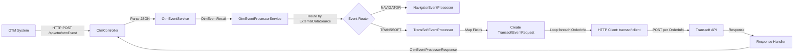
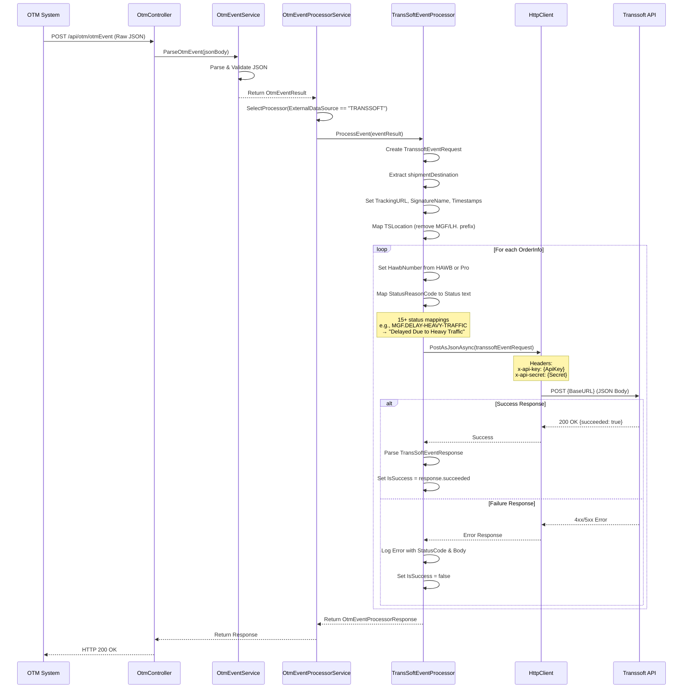
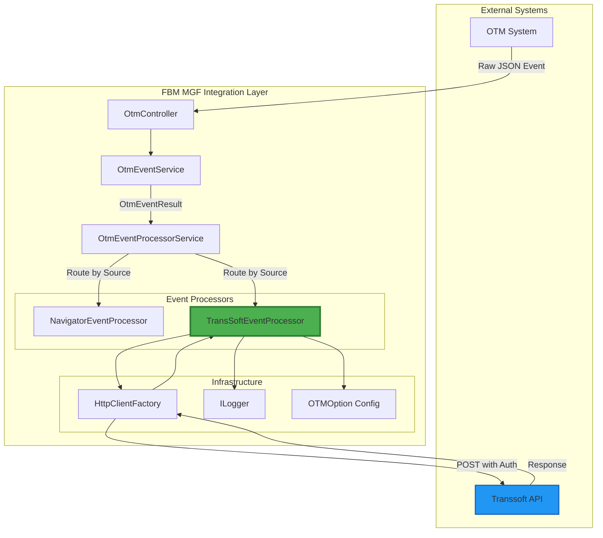

# Transsoft Target System Integration Documentation

## Table of Contents
1. [Overview](#overview)
2. [Data Flow Architecture](#data-flow-architecture)
3. [Transsoft API Contract](#transsoft-api-contract)
4. [Field Mapping Specification](#field-mapping-specification)
5. [Dependencies](#dependencies)
6. [Configuration](#configuration)
7. [Implementation Details](#implementation-details)
8. [Payload Size Expectations](#payload-size-expectations)
9. [Error Handling & Failure Scenarios](#error-handling--failure-scenarios)
10. [Risks & Mitigation](#risks--mitigation)
11. [Testing Strategy](#testing-strategy)
12. [Monitoring & Observability](#monitoring--observability)

---

## Overview

The Transsoft integration enables the FBM MGF Integration Layer to forward shipment tracking events from Oracle Transportation Management (OTM) to Transsoft's Transportation Management System. This integration is part of the OTM domain's event processing pipeline.

**Purpose**: Forward real-time shipment status updates from OTM to Transsoft for downstream processing and customer visibility.

**Integration Type**: Event-driven HTTP REST API integration

**Domain**: OTM (Oracle Transportation Management)

**Processing Pattern**: One API call per OrderInfo item (not batched)

---

## Data Flow Architecture

### High-Level Data Flow Diagram



### Detailed Process Flow



### Component Interaction



---

## Transsoft API Contract

### Endpoint Details

| Property | Value |
|----------|-------|
| **Base URL** | `https://uat.transsoft.com/api/v1/` (UAT) |
| **Production URL** | `https://api.transsoft.com/api/v1/` (To be confirmed) |
| **Endpoint Path** | `/` (posts to base URL directly) |
| **Full URL** | `{TransSoft_BaseURL}` (configurable) |
| **Method** | `POST` |
| **Content-Type** | `application/json` |

### Authentication & Headers

Transsoft API uses **header-based authentication** with API Key and Secret:

| Header Name | Source | Description |
|-------------|--------|-------------|
| `x-api-key` | `TransSoft_ApiKeyName` config | API Key header name (configurable) |
| `x-api-secret` | `TransSoft_ApiSecretName` config | API Secret header name (configurable) |
| **Header Value (Key)** | `TransSoft_ApiKey` | Actual API Key value |
| **Header Value (Secret)** | `TransSoft_Secret` | Actual API Secret value |

**Authentication Configuration**:
```csharp
// Program.cs - Line 74
services.AddHttpClient("transsoftclient", (serviceProvider, httpClient) =>
{
    var options = serviceProvider.GetRequiredService<IOptions<OTMOption>>().Value;
    httpClient.BaseAddress = new Uri(options.TransSoft_BaseURL);
    httpClient.DefaultRequestHeaders.Add(options.TransSoft_ApiKeyName, options.TransSoft_ApiKey);
    httpClient.DefaultRequestHeaders.Add(options.TransSoft_ApiSecretName, options.TransSoft_Secret);
});
```

### Request Body Format

The API expects a **single** `TranssoftEventRequest` object (one event per API call):

```json
{
  "hawbNumber": "HAWB12345678",
  "status": "Delayed Due to Heavy Traffic",
  "statusDateTimeLocal": "2026-01-01T14:30:00",
  "statusDateTimeUTC": "2026-01-01T14:30:00",
  "location": "ORD",
  "signatureName": "John Doe",
  "trackingURL": "https://tracking.example.com/HAWB12345678"
}
```

**C# Request Model**:
```csharp
public class TranssoftEventRequest
{
    public string HawbNumber { get; set; } = string.Empty;  // Required: HAWB or Pro number
    public string? Status { get; set; }                      // Required: Mapped status description
    public string? StatusDateTimeLocal { get; set; }         // Required: ISO 8601 string
    public string? StatusDateTimeUTC { get; set; }           // Required: ISO 8601 string
    public string? Location { get; set; }                    // Optional: Station code (no MGF/LH. prefix)
    public string? SignatureName { get; set; }               // Optional: User full name
    public string? TrackingURL { get; set; }                 // Optional: Tracking URL
}
```

### Response Handling

#### Success Response (HTTP 200)

**Expected Response Body**:
```json
{
  "data": {
    "isSuccess": true,
    "noofRecordsProcessed": 1
  },
  "succeeded": true
}
```

**C# Response Model**:
```csharp
public class TransSoftEventResponse
{
    public CreateOtmEventData data { get; set; }
    public bool succeeded { get; set; }
}

public class CreateOtmEventData
{
    public bool isSuccess { get; set; }
    public int noofRecordsProcessed { get; set; }
}
```

**Handling**:
```csharp
if (response.IsSuccessStatusCode)
{
    _logger.LogInformation("Response Successful.");
    var createOtmEventResponse = await response.Content.ReadFromJsonAsync<TransSoftEventResponse>();
    otmEventProcessorResponse.IsSuccess = createOtmEventResponse.succeeded;
}
```

#### Failure Response (HTTP 4xx/5xx)

**Handling**:
```csharp
string responseContent = await response.Content.ReadAsStringAsync();
otmEventProcessorResponse.Message = responseContent;
otmEventProcessorResponse.IsSuccess = false;
_logger.LogError("Request Failed with StatusCode: {StatusCodeInt} and Reason: {Reason}", 
    (int)response.StatusCode, responseContent);
```

#### Common Response Codes

| Status Code | Meaning | Handling Strategy |
|-------------|---------|-------------------|
| **200 OK** | Success | Parse response, set IsSuccess based on succeeded field |
| **400 Bad Request** | Invalid payload | Log error details, investigate mapping |
| **401 Unauthorized** | Invalid credentials | Check API Key/Secret configuration |
| **403 Forbidden** | Access denied | Verify API permissions with Transsoft |
| **404 Not Found** | Endpoint not found | Verify base URL configuration |
| **429 Too Many Requests** | Rate limit exceeded | Implement retry with backoff |
| **500 Internal Server Error** | Transsoft server error | Log and retry, escalate if persistent |
| **503 Service Unavailable** | Service down | Retry with exponential backoff |

---

## Field Mapping Specification

### OTM Event → Transsoft Event Mapping

| Source Field (OtmEventResult) | Target Field (TranssoftEventRequest) | Transformation Logic | Required | Notes |
|-------------------------------|--------------------------------------|---------------------|----------|-------|
| `OrdersInfo[].HAWB` or `OrdersInfo[].Pro` | `HawbNumber` | Uses HAWB if available, else Pro | **Yes** | Primary identifier |
| `StatusReasonCode` | `Status` | Complex mapping via if-else chain (15+ mappings) | **Yes** | Maps MGF codes to descriptive text |
| `EventDatetime` | `StatusDateTimeLocal` | Direct string assignment | **Yes** | ISO 8601 timestamp string |
| `EventDatetime` | `StatusDateTimeUTC` | Direct string assignment (currently same as Local) | **Yes** | ISO 8601 timestamp string |
| `TSLocation` | `Location` | RemoveMGFDomainName() - strips "MGF/LH." prefix | No | Station code |
| `SignatureName` | `SignatureName` | Direct mapping | No | Person/system name |
| `TrackingURL` | `TrackingURL` | Direct mapping | No | External tracking URL |

### Status Code Mapping Logic

The implementation uses `StatusReasonCode` to determine the Transsoft status via a comprehensive if-else chain:

| OTM StatusReasonCode | Transsoft Status | Description |
|----------------------|------------------|-------------|
| `MGF.DELAY-DOT-INSPECTION` | `Delayed Due to DOT truck inspection` | DOT inspection delay |
| `MGF.DELAY-ORIGIN` | `Delayed Departure at Origin` | Origin departure delay |
| `MGF.DELAY-MISROUTE` | `Delayed Due to Mis-route` | Package mis-routed |
| `MGF.DELAY-MECH-FAILURE` | `Delayed Due to Mechanical Issue` | Mechanical failure |
| `MGF.DELAY-ACCIDENT` | `Vehicle Involved In Accident` | Vehicle accident |
| `MGF.DELAY-ORIGIN-NO-POWERUNIT` | `Delayed Departure at Origin - No Power` | No power unit |
| `MGF.DELAY-HUB-CAPACITY` | `Delayed Departure at Hub - Capacity` | Hub capacity issue |
| `MGF.DELAY-HEAVY-TRAFFIC` | `Delayed Due to Heavy Traffic` | Heavy traffic |
| `MGF.DELAY-MISSTAGED-TERMINAL` | `Delayed Due to Mis-Staged at Terminal` | Terminal mis-staging |
| `MGF.DELAY-TIRE-BLOWOUT` | `Delayed Due To Tire Blowout` | Tire blowout |
| `MGF.DELAY-DRIVER-ILLNESS` | `Delayed Due to Driver Illness` | Driver illness |
| `MGF.DELAY-CONST-TRAFFIC` | `Delayed Due to Traffic - Construction` | Construction traffic |
| `MGF.DELAY-STATION-CAPACITY` | `Delay Due to Station Capacity` | Station capacity |
| (Any other) | `Status not available` | Default fallback |

**Implementation** (TransSoftEventProcessor.cs - Lines 48-117):
```csharp
var navEventType = "";

if (eventResult.StatusReasonCode == "MGF.DELAY-DOT-INSPECTION")
    navEventType = "Delayed Due to DOT truck inspection";
else if (eventResult.StatusReasonCode == "MGF.DELAY-ORIGIN")
    navEventType = "Delayed Departure at Origin";
else if (eventResult.StatusReasonCode == "MGF.DELAY-MISROUTE")
    navEventType = "Delayed Due to Mis-route";
// ... (15+ else-if conditions)
else
    navEventType = "Status not available";

transsoftEventRequest.Status = navEventType;
```

**Note**: Code contains duplicate mappings for some status codes (DELAY-HEAVY-TRAFFIC, DELAY-CONST-TRAFFIC, DELAY-MECH-FAILURE appear twice with similar descriptions).

### DateTime Handling Logic

**Current Implementation**: DateTime values are passed as **strings** without parsing:

```csharp
transsoftEventRequest.StatusDateTimeUTC = eventResult.EventDatetime;
transsoftEventRequest.StatusDateTimeLocal = eventResult.EventDatetime; // Temporarily same as UTC
```

**Key Points**:
- Both Local and UTC fields receive the **same value** from `EventDatetime`
- No timezone conversion performed
- Values remain as ISO 8601 strings (e.g., "2026-01-01T14:30:00")
- Code comment indicates: `//temporary`

**TODO**: Implement proper timezone conversion for Local vs UTC timestamps.

### Location Mapping

**Domain Prefix Removal**:
```csharp
private const string MGF_Domain = "MGF/LH.";

private string RemoveMGFDomainName(string str) => 
    str?.Replace(MGF_Domain, string.Empty) ?? string.Empty;

// Usage
transsoftEventRequest.Location = RemoveMGFDomainName(Convert.ToString(eventResult.TSLocation));
```

**Example**: `"MGF/LH.ORD"` → `"ORD"`

### Complete Mapping Example

**Input (OtmEventResult)**:
```json
{
  "userName": "OTMUSER",
  "userFullName": "OTM Integration User",
  "externalDataSource": "TRANSSOFT",
  "statusReasonCode": "MGF.DELAY-HEAVY-TRAFFIC",
  "eventDatetime": "2026-01-01T10:30:00",
  "signatureName": "John Smith",
  "trackingURL": "https://tracking.project44.com/12345",
  "tsLocation": "MGF/LH.ORD",
  "ordersInfo": [
    {
      "orderReleaseId": "ORD-001",
      "hawb": "HAWB12345678",
      "pro": "PRO-999",
      "customer": "ACME Corp",
      "orderSource": "TRANSSOFT"
    },
    {
      "orderReleaseId": "ORD-002",
      "hawb": "HAWB87654321",
      "pro": "PRO-888"
    }
  ],
  "shipmentInfos": [
    {
      "shipmentDestination": "LAX"
    }
  ]
}
```

**Output** - **Two separate API calls** (one per OrderInfo):

**API Call 1**:
```json
{
  "hawbNumber": "HAWB12345678",
  "status": "Delayed Due to Heavy Traffic",
  "statusDateTimeLocal": "2026-01-01T10:30:00",
  "statusDateTimeUTC": "2026-01-01T10:30:00",
  "location": "ORD",
  "signatureName": "John Smith",
  "trackingURL": "https://tracking.project44.com/12345"
}
```

**API Call 2**:
```json
{
  "hawbNumber": "HAWB87654321",
  "status": "Delayed Due to Heavy Traffic",
  "statusDateTimeLocal": "2026-01-01T10:30:00",
  "statusDateTimeUTC": "2026-01-01T10:30:00",
  "location": "ORD",
  "signatureName": "John Smith",
  "trackingURL": "https://tracking.project44.com/12345"
}
```

**Processing Notes**:
- Loop processes each OrderInfo sequentially (`foreach`)
- Each iteration makes a separate HTTP POST
- HAWB field is preferred over Pro for hawbNumber
- All other fields (status, timestamps, location, etc.) are **shared** across all OrderInfo items
- If one API call fails, the loop continues (no circuit breaker)

---

## Dependencies

### Internal Dependencies

| Dependency | Type | Purpose | Location |
|------------|------|---------|----------|
| **OtmController** | Controller | Entry point for OTM events | `Controllers/OtmController.cs` |
| **IOtmEventProcessorService** | Service | Routes events to appropriate processor | `Domains/OTM/Services/IOtmEventProcessorService.cs` |
| **IOtmEventService** | Service | Parses raw JSON to OtmEventResult | `Domains/OTM/Services/IOtmEventService.cs` |
| **TransSoftEventProcessor** | Processor | Processes Transsoft-specific events | `Domains/OTM/Services/TransSoftEventProcessor.cs` |
| **OTMOption** | Configuration | Configuration settings | `Domains/OTM/OTMOption.cs` |
| **TranssoftEventRequest** | Model | Request payload model | `Domains/OTM/Models/OtmEventRequestResponse.cs` |
| **TransSoftEventResponse** | Model | Response model | `Domains/OTM/Models/OtmEventRequestResponse.cs` |
| **OtmEventResult** | Model | Parsed event data | `Domains/OTM/Services/OtmEventResult.cs` |

### External Dependencies

| Dependency | Version | Purpose | NuGet Package |
|------------|---------|---------|---------------|
| **Microsoft.Extensions.Http** | 9.0+ | HTTP client factory | `Microsoft.Extensions.Http` |
| **Microsoft.Extensions.Logging** | 9.0+ | Logging infrastructure | `Microsoft.Extensions.Logging` |
| **Microsoft.Extensions.Options** | 9.0+ | Configuration options | `Microsoft.Extensions.Options` |
| **System.Text.Json** | 9.0+ | JSON serialization | Built-in (.NET 9.0) |

### Service Registration

**Program.cs Configuration**:
```csharp
services.AddHttpClient("transsoftclient", (serviceProvider, httpClient) =>
{
    var options = serviceProvider.GetRequiredService<IOptions<OTMOption>>().Value;
    httpClient.BaseAddress = new Uri(options.TransSoft_BaseURL);
    httpClient.DefaultRequestHeaders.Add(options.TransSoft_ApiKeyName, options.TransSoft_ApiKey);
    httpClient.DefaultRequestHeaders.Add(options.TransSoft_ApiSecretName, options.TransSoft_Secret);
});
```

**⚠️ CRITICAL BUG**: HTTP client name mismatch
- **Program.cs creates**: `"transsoftclient"`
- **TransSoftEventProcessor uses**: `"transoftclient"` (missing 's')
- **Impact**: HttpClient factory will throw exception at runtime
- **Fix Required**: Change line 18 in TransSoftEventProcessor.cs to use `"transsoftclient"`

### Network Dependencies

| Dependency | Type | Endpoint | Required Ports |
|------------|------|----------|----------------|
| **Transsoft API** | External API | `https://uat.transsoft.com/api/v1/` | HTTPS (443) |
| **DNS Resolution** | Network | `uat.transsoft.com` / `api.transsoft.com` | DNS (53) |
| **Internet Access** | Network | Outbound HTTPS | Firewall rules required |

---

## Configuration

### Configuration Structure

**File**: `appsettings.json` / Environment Variables

```json
{
  "OTM": {
    "BaseUrl": "https://tmsgateway-uat.pilotdelivers.com/v1/events",
    "ApiKeyName": "x-api-key",
    "ApiSecretName": "x-api-secret",
    "ApiKey": "testtest",
    "ApiSecret": "testtest",
    "TransSoft_BaseURL": "https://uat.transsoft.com/api/v1/",
    "TransSoft_ApiKeyName": "x-api-key",
    "TransSoft_ApiSecretName": "x-api-secret",
    "TransSoft_ApiKey": "test",
    "TransSoft_Secret": "test"
  }
}
```

### Environment Variables (Production)

```bash
# Transsoft Configuration
OTM__TransSoft_BaseURL="https://api.transsoft.com/api/v1/"
OTM__TransSoft_ApiKeyName="x-api-key"
OTM__TransSoft_ApiSecretName="x-api-secret"
OTM__TransSoft_ApiKey="<production-api-key>"
OTM__TransSoft_Secret="<production-api-secret>"
```

### Configuration Properties

| Property | Type | Required | Default | Description |
|----------|------|----------|---------|-------------|
| `TransSoft_BaseURL` | string | **Yes** | - | Base URL for Transsoft API (with trailing slash) |
| `TransSoft_ApiKeyName` | string | **Yes** | `x-api-key` | HTTP header name for API key |
| `TransSoft_ApiSecretName` | string | **Yes** | `x-api-secret` | HTTP header name for API secret |
| `TransSoft_ApiKey` | string | **Yes** | - | API key credential value |
| `TransSoft_Secret` | string | **Yes** | - | API secret credential value |

### Configuration Validation

```csharp
[Required]
public string TransSoft_BaseURL { get; set; } = string.Empty;

[Required]
public string TransSoft_ApiKeyName { get; set; } = string.Empty;

[Required]
public string TransSoft_ApiSecretName { get; set; } = string.Empty;

[Required]
public string TransSoft_ApiKey { get; set; } = string.Empty;

[Required]
public string TransSoft_Secret { get; set; } = string.Empty;
```

**Validation enforced at startup**:
```csharp
services.AddOptions<OTMOption>()
    .BindConfiguration(OTMOption.SectionName)
    .ValidateDataAnnotations()
    .ValidateOnStart();
```

---

## Implementation Details

### Current Implementation Status

| Component | Status | Location |
|-----------|--------|----------|
| **API Endpoint** | ✅ Implemented | `Controllers/OtmController.cs` Line 47-60 |
| **Event Parser** | ✅ Implemented | `Domains/OTM/Services/OtmEventService.cs` |
| **Event Router** | ✅ Implemented | `Domains/OTM/Services/OtmEventProcessorService.cs` Line 22-57 |
| **TransSoft Processor** | ✅ Implemented | `Domains/OTM/Services/TransSoftEventProcessor.cs` |
| **Field Mapping** | ✅ Implemented | TransSoftEventProcessor Lines 30-125 |
| **HTTP Client Config** | ✅ Implemented | `Program.cs` Line 74-80 |
| **Configuration Model** | ✅ Implemented | `Domains/OTM/OTMOption.cs` Line 33-45 |
| **Response Models** | ✅ Implemented | `Domains/OTM/Models/OtmEventRequestResponse.cs` Line 55-90 |

### Key Implementation Classes

#### 1. TransSoftEventProcessor

**File**: `Domains/OTM/Services/TransSoftEventProcessor.cs`

**Key Methods**:
- `ProcessEvent(OtmEventResult eventResult)`: Main processing logic (Lines 23-150)
- `RemoveMGFDomainName(string str)`: Strips "MGF/LH." prefix (Line 152)
- `CallTransSoftApi(TranssoftEventRequest)`: Makes HTTP POST call (Lines 154-158)

**Processing Flow**:
1. Receive `OtmEventResult` from router
2. Create base `TranssoftEventRequest` object with shared fields
3. Extract `shipmentDestination` from shipmentInfos
4. Set TrackingURL, SignatureName, Timestamps from eventResult
5. Map TSLocation (remove MGF/LH. prefix)
6. **Loop through OrdersInfo collection** (`foreach`)
7. For each OrderInfo:
   - Set HawbNumber from HAWB (or Pro if HAWB empty)
   - Map StatusReasonCode to Status text via if-else chain
   - Make individual HTTP POST to Transsoft API
   - Parse response and update IsSuccess flag
8. Return `OtmEventProcessorResponse`

**Constants**:
```csharp
private const string NAVG = nameof(NAVG);
private const string MGF_Domain = "MGF/LH.";
```

#### 2. Event Routing Logic

**File**: `OtmEventProcessorService.cs`

```csharp
private IOtmEventProcessor? SelectProcessor(OtmEventResult eventResult)
{
    if (eventResult.ExternalDataSource == "NAVIGATOR")
    {
        return _processors.OfType<NavigatorEventProcessor>().FirstOrDefault()
            ?? new NavigatorEventProcessor(_logger, _httpClientFactory, _options);
    }
    else if (eventResult.ExternalDataSource == "TRANSSOFT")
    {
        return _processors.OfType<TransSoftEventProcessor>().FirstOrDefault()
            ?? new TransSoftEventProcessor(_transsoftlogger, _httpClientFactory, _options);
    }
    return null;
}
```

**Routing Key**: `eventResult.ExternalDataSource == "TRANSSOFT"`

#### 3. HTTP Client Configuration

**Named HTTP Client**: `transsoftclient`

**Configuration** (Program.cs Lines 74-80):
```csharp
services.AddHttpClient("transsoftclient", (serviceProvider, httpClient) =>
{
    var options = serviceProvider.GetRequiredService<IOptions<OTMOption>>().Value;
    httpClient.BaseAddress = new Uri(options.TransSoft_BaseURL);
    httpClient.DefaultRequestHeaders.Add(options.TransSoft_ApiKeyName, options.TransSoft_ApiKey);
    httpClient.DefaultRequestHeaders.Add(options.TransSoft_ApiSecretName, options.TransSoft_Secret);
});
```

**⚠️ BUG**: Processor creates client with wrong name `"transoftclient"` (Line 18)

### API Endpoint

**Endpoint**: `POST /api/otm/otmEvent`

**Implementation** (OtmController.cs Lines 47-60):
```csharp
[HttpPost("otmEvent")]
public async Task<IActionResult> PostOTMEventAsync()
{
    using var reader = new StreamReader(Request.Body);
    var jsonBody = await reader.ReadToEndAsync();
    
    _logger.LogInformation("Received OTM Event: {JsonBody}", jsonBody);
    
    var result = await otmEventProcessorService.HandleOtmEvent(jsonBody);
    
    _logger.LogInformation("Processed OTM Event Result: {Result}", result);
    
    return Ok(result);
}
```

---

## Payload Size Expectations

### Typical Payload Characteristics

| Metric | Typical Value | Maximum Expected | Notes |
|--------|---------------|------------------|-------|
| **Events per Request** | 1 | 1 | **One API call per OrderInfo item** |
| **Single Event Size** | ~300 bytes | ~1 KB | JSON-serialized TranssoftEventRequest |
| **Total Request Size** | ~300 bytes | ~1 KB | Single event object (not array) |
| **Fields per Event** | 7 | 7 | Fixed schema |
| **String Field Lengths** | 20-200 chars | 500 chars | HAWB, Status descriptions, URLs |
| **API Calls per OTM Event** | 1-5 | 50 | Depends on OrdersInfo count |

### Size Calculation Examples

**Single Event** (typical request):
```json
{
  "hawbNumber": "HAWB12345678",                           // ~20 bytes
  "status": "Delayed Due to Heavy Traffic",               // ~40 bytes
  "statusDateTimeLocal": "2026-01-01T14:30:00",          // ~25 bytes
  "statusDateTimeUTC": "2026-01-01T14:30:00",            // ~25 bytes
  "location": "ORD",                                      // ~10 bytes
  "signatureName": "John Doe",                            // ~15 bytes
  "trackingURL": "https://tracking.example.com/HAWB"     // ~50 bytes
}
// Total: ~185 bytes (raw) + JSON overhead (~70 bytes) = ~255 bytes per request
```

**Multiple OrderInfo Items**: Each generates a separate API call
- 5 OrderInfo items = 5 sequential API requests × ~255 bytes = ~1.3 KB total traffic
- 10 OrderInfo items = 10 sequential API requests = ~2.6 KB total traffic
- 50 OrderInfo items = 50 sequential API requests = ~13 KB total traffic

### Performance Considerations

| Aspect | Consideration | Impact |
|--------|---------------|--------|
| **Network Latency** | Each OrderInfo triggers separate HTTP request (~50-200ms each) | **Major bottleneck** for multiple OrderInfo items |
| **Sequential Processing** | API calls made in loop (`foreach`) - blocking | 10 items = 500ms-2s total latency |
| **Serialization** | JSON serialization per event ~1-2ms | Minimal impact |
| **Memory** | Single event object per call | No concern |
| **Timeout** | Default HTTP timeout applies per request | Acceptable for single-event payloads |
| **Error Handling** | One failure doesn't stop loop | Partial success possible |

### Recommendations

1. **Current Implementation**: Makes **one API call per OrderInfo item** (not batched)
2. **Performance Impact**: 
   - 10 OrderInfo items = 10 sequential HTTP requests = 500ms-2s
   - 50 OrderInfo items = 50 sequential HTTP requests = 2.5s-10s
3. **Potential Optimization**: 
   - If Transsoft API supports batch requests, send array of events
   - Implement parallel processing using `Parallel.ForEachAsync`:
   ```csharp
   await Parallel.ForEachAsync(eventResult.OrdersInfo, 
       new ParallelOptions { MaxDegreeOfParallelism = 5 },
       async (orderInfo, ct) => 
   {
       var response = await CallTransSoftApi(transsoftEventRequest);
       // Handle response
   });
   ```
4. **Circuit Breaker**: Current implementation has no circuit breaker - continues processing even after multiple failures
5. **Retry Logic**: No retry mechanism for failed individual requests

---

## Error Handling & Failure Scenarios

### Error Categories

#### 1. Configuration Errors

| Error | Cause | Detection | Resolution |
|-------|-------|-----------|------------|
| **Missing Base URL** | `TransSoft_BaseURL` not configured | Startup validation failure | Set in appsettings or environment |
| **Invalid URL Format** | Malformed URL string | HttpClient creation exception | Validate URL format |
| **Missing Credentials** | API Key/Secret not set | Startup validation failure | Configure credentials |
| **Empty Credentials** | API Key/Secret are empty strings | 401 Unauthorized at runtime | Set valid credentials |

**Startup Validation Error**:
```
System.AggregateException: Options validation failed for 'OTMOption'
  - TransSoft_BaseURL is required
```

#### 2. Network Errors

| Error | Cause | HTTP Status | Current Handling |
|-------|-------|-------------|------------------|
| **DNS Resolution Failure** | Cannot resolve transsoft.com | Exception | Caught by try-catch, logged |
| **Connection Timeout** | Network unreachable | Exception | Caught by try-catch, logged |
| **TLS/SSL Error** | Certificate validation failure | Exception | Caught by try-catch, logged |
| **Connection Refused** | Service not listening | Exception | Caught by try-catch, logged |

**Exception Handling**:
```csharp
catch (Exception ex)
{
    _logger.LogError("An exception accounted in TransSoftEventProcessor/ProcessEvent : {message}, {StackTrace}", 
        ex.Message, ex.StackTrace);
}
// Note: Loop continues processing remaining OrderInfo items
```

#### 3. Authentication Errors

| HTTP Status | Error | Cause | Resolution |
|-------------|-------|-------|------------|
| **401 Unauthorized** | Invalid credentials | Wrong API Key/Secret | Verify configuration |
| **403 Forbidden** | Access denied | Valid creds, insufficient permissions | Contact Transsoft support |

**Current Handling**:
```csharp
if (!response.IsSuccessStatusCode)
{
    string responseContent = await response.Content.ReadAsStringAsync();
    otmEventProcessorResponse.Message = responseContent;
    otmEventProcessorResponse.IsSuccess = false;
    _logger.LogError("Request Failed with StatusCode: {StatusCodeInt} and Reason: {Reason}", 
        (int)response.StatusCode, responseContent);
}
```

#### 4. Payload Errors

| HTTP Status | Error | Cause | Resolution |
|-------------|-------|-------|------------|
| **400 Bad Request** | Invalid payload format | Missing required fields | Review field mapping |
| **422 Unprocessable Entity** | Business validation failure | Invalid HAWB or status | Validate input data |

#### 5. Transsoft API Errors

| HTTP Status | Error | Cause | Strategy |
|-------------|-------|-------|----------|
| **500 Internal Server Error** | Transsoft bug | Server-side issue | Log, retry once, escalate |
| **502 Bad Gateway** | Proxy error | Infrastructure issue | Retry with backoff |
| **503 Service Unavailable** | Maintenance/overload | Transsoft down | Retry with delay |
| **504 Gateway Timeout** | Upstream timeout | Slow response | Increase timeout, retry |

### Failure Scenarios

#### Scenario 1: Complete Service Outage

**Situation**: Transsoft API completely down

**Impact**: 
- All events fail with connection exceptions
- OTM controller still returns 200 OK
- No event persistence or retry queue

**Detection**: 
- Logs show repeated connection failures
- All OrderInfo processing fails

**Mitigation**:
- Implement event persistence (DB or queue)
- Add retry mechanism with exponential backoff
- Alert after N consecutive failures

#### Scenario 2: Partial Failures (Some OrderInfo Items Succeed)

**Situation**: First 3 OrderInfo items succeed, 4th fails with 400 error

**Current Behavior**:
```csharp
foreach (var orderInfo in eventResult.OrdersInfo)
{
    // Process item
    var response = await CallTransSoftApi(transsoftEventRequest);
    
    if (response.IsSuccessStatusCode) {
        // Set IsSuccess = true
    } else {
        // Set IsSuccess = false, log error
        // BUT LOOP CONTINUES - processes remaining items
    }
}
// Last IsSuccess value is returned (from last OrderInfo item)
```

**Issue**: Only the **last** OrderInfo item's success/failure status is returned. Earlier failures are logged but not reflected in final response.

**Recommended Enhancement**: Track success/failure per OrderInfo item and return aggregated result.

#### Scenario 3: HTTP Client Name Mismatch Bug

**Situation**: Runtime exception when creating HttpClient

**Cause**: 
- Program.cs registers: `"transsoftclient"`
- Processor requests: `"transoftclient"` (missing 's')

**Error**:
```
InvalidOperationException: HttpClient factory could not find client 'transoftclient'
```

**Impact**: **All Transsoft events fail immediately**

**Fix Required**: Change TransSoftEventProcessor.cs Line 18:
```csharp
// FROM:
_httpClient = httpClientFactory.CreateClient("transoftclient");

// TO:
_httpClient = httpClientFactory.CreateClient("transsoftclient");
```

#### Scenario 4: Invalid Status Mapping

**Situation**: OTM sends unknown StatusReasonCode

**Example**: `MGF.DELAY-UNKNOWN-ISSUE`

**Current Behavior**: Falls through to else block:
```csharp
else
{
    navEventType = "Status not available";
}
```

**Impact**: Transsoft receives literal text "Status not available"

**Question**: Does Transsoft accept this status value?

#### Scenario 5: Duplicate Status Mappings

**Situation**: Same StatusReasonCode mapped multiple times

**Examples**:
- `MGF.DELAY-HEAVY-TRAFFIC` mapped twice (lines 73 and 93)
- `MGF.DELAY-CONST-TRAFFIC` mapped twice (lines 87 and 103)
- `MGF.DELAY-MECH-FAILURE` mapped twice (lines 60 and 82)

**Current Behavior**: First mapping wins (subsequent else-if never reached)

**Recommendation**: Remove duplicate mappings, consolidate status descriptions

---

## Risks & Mitigation

### Technical Risks

| Risk | Severity | Probability | Impact | Mitigation |
|------|----------|-------------|--------|------------|
| **HTTP Client Name Bug** | **CRITICAL** | **High** | All Transsoft events fail | Fix client name in code |
| **API Downtime** | High | Medium | Events lost | Implement persistence & retry |
| **Sequential Processing Performance** | High | High | Slow processing for multiple items | Implement parallel processing |
| **Authentication Failure** | Medium | Low | All requests fail | Monitor credentials, alerts |
| **No Retry Logic** | High | Medium | Transient failures cause data loss | Implement exponential backoff |
| **Partial Failure Tracking** | Medium | Medium | Incorrect success reporting | Track per-item results |
| **Duplicate Status Mappings** | Low | Low | Unreachable code | Remove duplicates |
| **Timezone Handling** | Low | Medium | Incorrect timestamps | Implement proper UTC conversion |

### Data Quality Risks

| Risk | Impact | Mitigation |
|------|--------|------------|
| **Missing HAWB Numbers** | Events rejected | Validate before sending |
| **Unknown Status Codes** | "Status not available" sent | Define all status mappings |
| **Same Local/UTC Time** | Incorrect timestamps | Fix timezone conversion |
| **Empty Location** | Missing tracking data | Acceptable (nullable field) |

### Operational Risks

| Risk | Mitigation |
|------|------------|
| **Credential Leakage** | Use Azure Key Vault, never commit secrets |
| **No Circuit Breaker** | Implement circuit breaker pattern |
| **Insufficient Logging** | Already good, add correlation IDs |
| **No Performance Monitoring** | Add metrics for response times |

### Mitigation Priorities

**CRITICAL** (Fix Immediately):
1. 🔴 **Fix HTTP client name bug** - Breaks all Transsoft integration
2. 🔴 **Implement retry logic** - Transient failures cause data loss
3. 🔴 **Add event persistence** - No way to recover from failures

**High Priority**:
4. 🟠 **Parallel processing** - Performance bottleneck for multiple items
5. 🟠 **Per-item result tracking** - Current implementation loses failure info
6. 🟠 **Circuit breaker** - Prevents cascading failures

**Medium Priority**:
7. 🟡 **Fix timezone handling** - StatusDateTimeLocal should differ from UTC
8. 🟡 **Remove duplicate status mappings** - Code quality
9. 🟡 **Comprehensive status mapping** - Handle all possible codes

---

## Testing Strategy

### Unit Testing

**Test Coverage Areas**:

1. **Status Code Mapping Tests**
```csharp
[Theory]
[InlineData("MGF.DELAY-DOT-INSPECTION", "Delayed Due to DOT truck inspection")]
[InlineData("MGF.DELAY-ORIGIN", "Delayed Departure at Origin")]
[InlineData("MGF.DELAY-HEAVY-TRAFFIC", "Delayed Due to Heavy Traffic")]
[InlineData("MGF.UNKNOWN", "Status not available")]
public void MapStatusReasonCode_ReturnsExpectedStatus(string input, string expected)
{
    // Test the if-else chain mapping logic
}
```

2. **Location Prefix Removal Tests**
```csharp
[Theory]
[InlineData("MGF/LH.ORD", "ORD")]
[InlineData("MGF/LH.LAX", "LAX")]
[InlineData("ORD", "ORD")]
[InlineData(null, "")]
public void RemoveMGFDomainName_RemovesPrefix(string input, string expected)
{
    var result = RemoveMGFDomainName(input);
    Assert.Equal(expected, result);
}
```

3. **Event Processing Tests**
```csharp
[Fact]
public async Task ProcessEvent_WithMultipleOrderInfo_MakesMultipleAPICalls()
{
    // Arrange: Event with 3 OrderInfo items
    var eventResult = CreateOtmEventResultWithOrders(count: 3);
    var mockHttpClient = CreateMockHttpClient();
    
    // Act
    await processor.ProcessEvent(eventResult);
    
    // Assert: Verify 3 API calls were made
    mockHttpClient.Verify(x => x.PostAsJsonAsync(It.IsAny<string>(), It.IsAny<object>()), Times.Exactly(3));
}
```

4. **HTTP Client Name Test**
```csharp
[Fact]
public void HttpClientFactory_UsesCorrectClientName()
{
    // This test would catch the current bug
    var factory = serviceProvider.GetRequiredService<IHttpClientFactory>();
    var client = factory.CreateClient("transoftclient"); // Should throw or use transsoftclient
    Assert.NotNull(client);
}
```

### Integration Testing

**Test Scenarios**:

1. **End-to-End Happy Path**
```csharp
[Fact]
public async Task OtmEvent_ToTranssoft_SingleOrderInfo_Success()
{
    var jsonPayload = CreateTranssoftEventJson(orderInfoCount: 1);
    
    var response = await _httpClient.PostAsync("/api/otm/otmEvent", 
        new StringContent(jsonPayload, Encoding.UTF8, "application/json"));
    
    Assert.Equal(HttpStatusCode.OK, response.StatusCode);
    // Verify Transsoft mock received exactly 1 request
}
```

2. **Multiple OrderInfo Items**
```csharp
[Fact]
public async Task OtmEvent_ToTranssoft_MultipleOrderInfo_MakesMultipleCalls()
{
    var jsonPayload = CreateTranssoftEventJson(orderInfoCount: 5);
    
    var response = await _httpClient.PostAsync("/api/otm/otmEvent", 
        new StringContent(jsonPayload, Encoding.UTF8, "application/json"));
    
    // Verify Transsoft mock received exactly 5 sequential requests
}
```

3. **Authentication Failure Test**
```csharp
[Fact]
public async Task TranssoftApi_WithInvalidCredentials_Returns401()
{
    ConfigureTranssoftMockTo Return401();
    var response = await SendOtmEvent();
    
    // Verify error logged, IsSuccess=false
}
```

### Manual Testing Checklist

- [ ] **Configuration**
  - [ ] Valid credentials work
  - [ ] Invalid credentials return 401
  - [ ] Missing config fails at startup
  
- [ ] **Field Mapping**
  - [ ] All 15+ status codes map correctly
  - [ ] "MGF/LH." prefix removed from location
  - [ ] HAWB preferred over Pro for hawbNumber
  - [ ] Empty HAWB falls back to Pro
  
- [ ] **Multiple OrderInfo**
  - [ ] 1 OrderInfo = 1 API call
  - [ ] 5 OrderInfo = 5 API calls
  - [ ] Each call has correct HawbNumber
  - [ ] Shared fields (status, location, etc.) consistent
  
- [ ] **Error Scenarios**
  - [ ] First OrderInfo fails, remaining still process
  - [ ] Network timeout logged, doesn't crash
  - [ ] 500 error logged with details
  
- [ ] **Performance**
  - [ ] Single OrderInfo processes in <300ms
  - [ ] 10 OrderInfo items complete in <3s

---

## Monitoring & Observability

### Key Metrics

| Metric | Type | Description | Alert Threshold |
|--------|------|-------------|-----------------|
| **transsoft_requests_total** | Counter | Total API calls to Transsoft | N/A |
| **transsoft_requests_per_event** | Histogram | OrderInfo count distribution | Monitor p95 |
| **transsoft_requests_failed** | Counter | Failed API calls | >5 in 5 minutes |
| **transsoft_request_duration** | Histogram | API response time per call | p95 > 500ms |
| **transsoft_events_sent** | Counter | Successfully sent events | N/A |
| **transsoft_auth_failures** | Counter | 401 errors | >1 in 1 hour |
| **transsoft_4xx_errors** | Counter | Client errors | >10 in 5 minutes |
| **transsoft_5xx_errors** | Counter | Server errors | >3 in 5 minutes |
| **transsoft_processing_duration** | Histogram | Total time for all OrderInfo items | p95 > 5s |

### Logging Standards

**Current Logging**:

```csharp
// Success
_logger.LogInformation("Response Successful.");

// Failure
_logger.LogError("Request Failed with StatusCode: {StatusCodeInt} and Reason: {Reason}", 
    (int)response.StatusCode, responseContent);

// Exception
_logger.LogError("An exception accounted in TransSoftEventProcessor/ProcessEvent : {message}, {StackTrace}", 
    ex.Message, ex.StackTrace);
```

**Recommended Enhancements**:

```csharp
// Add correlation ID and HAWB number
_logger.LogInformation(
    "Transsoft API call successful. HAWB: {HAWB}, Duration: {Duration}ms, CorrelationId: {CorrelationId}",
    transsoftEventRequest.HawbNumber,
    stopwatch.ElapsedMilliseconds,
    correlationId
);

// Add OrderInfo index for troubleshooting
_logger.LogError(
    "Transsoft API call failed. OrderInfoIndex: {Index}/{Total}, HAWB: {HAWB}, StatusCode: {StatusCode}",
    currentIndex,
    totalOrderInfo,
    transsoftEventRequest.HawbNumber,
    (int)response.StatusCode
);
```

### Health Checks

**Recommended Implementation**:
```csharp
public class TranssoftHealthCheck : IHealthCheck
{
    public async Task<HealthCheckResult> CheckHealthAsync(
        HealthCheckContext context, 
        CancellationToken cancellationToken = default)
    {
        try
        {
            var client = _httpClientFactory.CreateClient("transsoftclient");
            var response = await client.GetAsync("health", cancellationToken);
            
            return response.IsSuccessStatusCode
                ? HealthCheckResult.Healthy("Transsoft API reachable")
                : HealthCheckResult.Degraded($"Transsoft returned {response.StatusCode}");
        }
        catch (Exception ex)
        {
            return HealthCheckResult.Unhealthy("Transsoft API unreachable", ex);
        }
    }
}
```

### Alerting Rules

**Critical Alerts** (Page on-call):
- HTTP client name exception (integration completely broken)
- Authentication failures (401) > 1 in 1 hour
- Error rate > 50% for 5 minutes
- Zero successful requests for 15 minutes

**Warning Alerts** (Ticket):
- Error rate > 10% for 10 minutes
- p95 latency > 2 seconds for processing
- 5xx errors > 10 in 10 minutes
- Large OrderInfo count (>20 items)

**Informational**:
- Unknown status code received
- OrderInfo count > 10
- Slow individual response (>1 second)

### Dashboard Panels

1. **Request Rate**: Transsoft API calls per minute
2. **Error Rate**: % failed requests over time
3. **Response Time**: p50, p95, p99 latency per API call
4. **Processing Time**: Total time to process all OrderInfo items
5. **OrderInfo Distribution**: Histogram of OrderInfo counts per OTM event
6. **Status Code Distribution**: Pie chart of HTTP responses
7. **Top Errors**: Most common error messages
8. **HAWB Processing**: Events per HAWB number

---

## Appendix

### Quick Reference Summary

✅ **Completed Requirements**:
1. ✅ Document required changes
2. ✅ Data flow diagrams (3 Mermaid diagrams)
3. ✅ Dependencies (internal, external, network)
4. ✅ Risks & mitigation strategies
5. ✅ Payload size expectations & calculations
6. ✅ Failure scenarios (5 categories)
7. ✅ API contract (endpoint, method, headers, auth)
8. ✅ Request/response formats
9. ✅ Field mapping table (OTM → Transsoft)
10. ✅ Status code mappings (15+ codes)

### Critical Issues Identified

| Issue | Severity | Line | Fix Required |
|-------|----------|------|--------------|
| HTTP client name mismatch | 🔴 CRITICAL | TransSoftEventProcessor:18 | Change `"transoftclient"` to `"transsoftclient"` |
| Duplicate status mappings | 🟡 Medium | Lines 73, 87, 93, 103 | Remove duplicates |
| No timezone conversion | 🟡 Medium | Line 37 | Implement proper Local/UTC handling |
| No retry logic | 🔴 HIGH | N/A | Add exponential backoff |
| No circuit breaker | 🟠 HIGH | N/A | Implement circuit breaker |
| Sequential processing | 🟠 HIGH | Line 43 (foreach) | Consider parallel processing |

### Known Limitations

1. **One API call per OrderInfo**: No batching support
2. **Partial failure tracking**: Only last OrderInfo result returned
3. **No event persistence**: Failed events not retried
4. **No timeout configuration**: Uses default HttpClient timeout
5. **Same Local/UTC timestamps**: No timezone conversion (temporary)

### Related Documentation

- [Architecture Overview](architecture/README.md)
- [OTM Domain](../Domains/OTM/)
- [API Documentation](api/README.md)
- [Troubleshooting Guide](troubleshooting/README.md)

### Contact & Support

| Role | Contact |
|------|---------|
| **Integration Team** | integration-team@company.com |
| **Transsoft Support** | support@transsoft.com |
| **DevOps** | devops@company.com |

---

**Document Version**: 1.0  
**Last Updated**: 2026-01-01  
**Status**: ✅ Complete (Based on current codebase)  
**Reviewed**: Pending

---

**END OF DOCUMENT**
