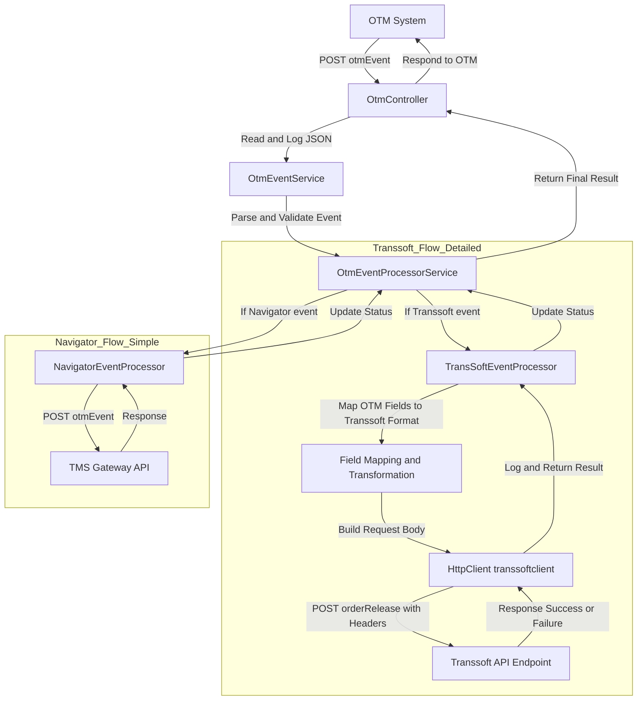

# Transsoft Integration Ticket Response

## 1. Required Changes to Support Transsoft Target System
- Implement TransSoftEventProcessor in the integration layer to handle orderRelease events for Transsoft.
- Add configuration for Transsoft API endpoint, authentication headers, and credentials in OTMOption.
- Map OTM event fields to Transsoft request format (see mapping table below).
- Ensure per-orderRelease event push (one API call per OrderInfo).
- Update error handling to log and track per-event success/failure.
- Fix HTTP client name bug ("transsoftclient" vs "transoftclient").


## 2. Data Flow Diagram: OTM → fbm → Transsoft (Detailed)




## 3. Dependencies
- OtmController, OtmEventService, OtmEventProcessorService, TransSoftEventProcessor, OTMOption config
- Microsoft.Extensions.Http, Logging, Options, System.Text.Json
- HTTPS to Transsoft API endpoint

## 4. Failure Scenarios
- API call failure (network, authentication, invalid payload)
- Mapping errors (missing/invalid fields)
- Unhandled exceptions in event processor
- Log error, set IsSuccess=false, continue processing remaining events

## 5. Transsoft API Contract Details

### Endpoint
- `https://uat.transsoft.com/api/v1/` (configured via `TransSoft_BaseURL` in OTMOption/appsettings.json)

### Method
- POST

### Headers/Auth Expectations
| Header Name      | Value Source           |
|------------------|-----------------------|
| x-api-key        | TransSoft_ApiKey      |
| x-api-secret     | TransSoft_Secret      |

### Expected Request Body Format
```json
{
  "hawbNumber": "HAWB12345678",
  "status": "Delayed Due to Heavy Traffic",
  "statusDateTimeLocal": "2026-01-01T14:30:00",
  "statusDateTimeUTC": "2026-01-01T14:30:00",
  "location": "ORD",
  "signatureName": "John Doe",
  "trackingURL": "https://tracking.example.com/HAWB12345678"
}
```

### Success/Failure Response Handling
```json
{
  "data": {
    "isSuccess": true,
    "noofRecordsProcessed": 1
  },
  "succeeded": true
}
```

## 6. Mapping Table (OTM Field → Transsoft Field)
| OTM Field                | Transsoft Field         | Transformation Logic                  |
|--------------------------|------------------------|---------------------------------------|
| OrdersInfo[].HAWB/Pro    | hawbNumber             | Prefer HAWB, fallback to Pro          |
| StatusReasonCode         | status                 | Map via if-else chain (15+ mappings)  |
| EventDatetime            | statusDateTimeLocal    | Direct string assignment              |
| EventDatetime            | statusDateTimeUTC      | Direct string assignment              |
| TSLocation               | location               | Remove "MGF/LH." prefix               |
| SignatureName            | signatureName          | Direct mapping                        |
| TrackingURL              | trackingURL            | Direct mapping                        |
