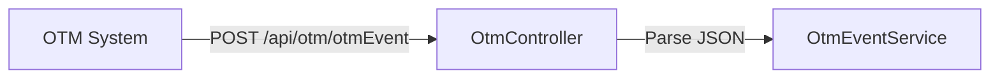

# Transsoft Integration Ticket Response

## 1. Required Changes to Support Transsoft Target System
- Implement TransSoftEventProcessor in fbbmintegration layer to handle orderRelease events for Transsoft.
- Add configuration for Transsoft API endpoint, authentication headers, and credentials in OTMOption.
- Map OTM event fields to Transsoft request format (see mapping table below).
- Ensure per-orderRelease event push (one API call per OrderInfo).
- Update error handling to log and track per-event success/failure.
- Fix HTTP client name bug ("transsoftclient" vs "transoftclient").

## 2. Data Flow Diagram: OTM → fbbm → Transsoft



## 3. Components/Services Handling orderRelease Events
- **OtmController**: Receives OTM event POST requests.
- **OtmEventService**: Parses and validates incoming event JSON.
- **OtmEventProcessorService**: Routes events to the correct processor (Navigator or Transsoft).
- **TransSoftEventProcessor**: Handles mapping and pushing events to Transsoft API.

## 4. Dependencies
- **Internal**: OtmController, OtmEventService, OtmEventProcessorService, TransSoftEventProcessor, OTMOption config.
- **External**: Microsoft.Extensions.Http, Logging, Options, System.Text.Json.
- **Network**: HTTPS to Transsoft API endpoint.

## 5. Risks
- HTTP client name bug can break all Transsoft pushes.
- No retry logic for transient failures.
## 6. Payload Size Expectations
- **Events per request**: 1 (one API call per OrderInfo)

## 7. Failure Scenarios

## 8. Transsoft API Contract Details

### Endpoint

### Method

### Headers/Auth Expectations
| Header Name      | Value Source           |
|------------------|-----------------------|
| x-api-key        | TransSoft_ApiKey      |
| x-api-secret     | TransSoft_Secret      |

### Expected Request Body Format
```json
{
  "hawbNumber": "HAWB12345678",
  "status": "Delayed Due to Heavy Traffic",
  "statusDateTimeLocal": "2026-01-01T14:30:00",
  "statusDateTimeUTC": "2026-01-01T14:30:00",
  "location": "ORD",
  "signatureName": "John Doe",
  "trackingURL": "https://tracking.example.com/HAWB12345678"
}
```

### Success/Failure Response Handling
```json
{
  "data": {
    "isSuccess": true,
    "noofRecordsProcessed": 1
  },
  "succeeded": true
}
```
  - Log error, set IsSuccess=false, continue processing remaining events.

## 9. Mapping Table (OTM Field → Transsoft Field)
| OTM Field                | Transsoft Field         | Transformation Logic                  |
|--------------------------|------------------------|---------------------------------------|
| OrdersInfo[].HAWB/Pro    | hawbNumber             | Prefer HAWB, fallback to Pro          |
| StatusReasonCode         | status                 | Map via if-else chain (15+ mappings)  |
| EventDatetime            | statusDateTimeLocal    | Direct string assignment              |
| EventDatetime            | statusDateTimeUTC      | Direct string assignment              |
| TSLocation               | location               | Remove "MGF/LH." prefix               |
| SignatureName            | signatureName          | Direct mapping                        |
| TrackingURL              | trackingURL            | Direct mapping                        |


**Acceptance:**
