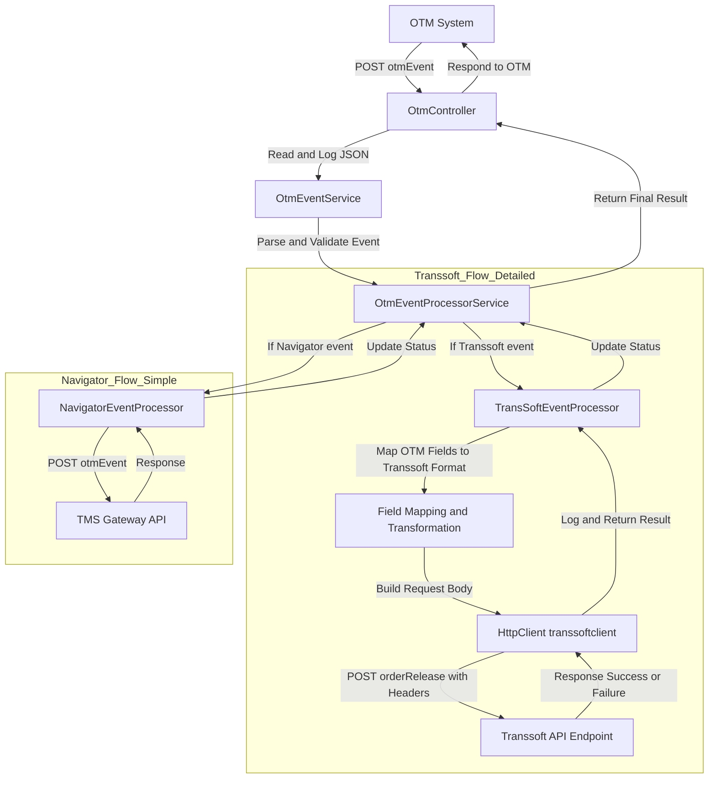

# Transsoft Integration Ticket Response

## 1. Required Changes to Support Transsoft Target System
- Implement TransSoftEventProcessor in the integration layer to handle orderRelease events for Transsoft.
- Add configuration for Transsoft API endpoint, authentication headers, and credentials in OTMOption.
- Map OTM event fields to Transsoft request format (see mapping table below).
- Ensure per-orderRelease event push (one API call per OrderInfo).
- Update error handling to log and track per-event success/failure.
- Fix HTTP client name bug ("transsoftclient" vs "transoftclient").


## 2. OTM to Transsoft Status Updates Workflow

### Integration Workflow (Step-by-Step)

1. **Event Generation in OTM**
   - Oracle OTM system creates an OrderRelease event
   - Event payload is generated in JSON format
   - Trigger happens when a new order is released or updated in OTM

2. **Event Push to Integration Layer**
   - OTM sends the JSON payload to the middleware layer
   - Target API endpoint: POST /fbbmintegration/otmevent
   - Transport protocol: HTTPS (REST call)

3. **Receive Payload in fbbmintegration**
   - otmevent API accepts incoming JSON from OTM
   - API logs the raw request for audit & traceability
   - API acknowledges receipt (HTTP 202 or 200 based on design)

4. **Schema Validation**
   - System validates JSON structure against expected OTM schema
   - Mandatory checks include:
     - Valid JSON format
     - Presence of required fields
     - No null values in mandatory attributes
     - Field data types must match contract

5. **Payload Transformation / Mapping**
   - Mapping engine processes validated JSON
   - Converts OTM event contract into Transsoft API contract
   - Applies transformation rules:
     - Field renaming
     - Data formatting
     - Enum mapping if required
     - Date/time conversion to +0530 if needed
     - Property names formatted to PascalCase (as per your preference)

6. **Prepare Mapped JSON for Transsoft**
   - Adapter creates final JSON object after mapping
   - Payload structure must comply exactly with Transsoft API requirements
   - Log mapped output before sending

7. **Send Data to Transsoft System**
   - API adapter sends mapped JSON using:
     - POST /transsoft/api/events (example logical path)
   - Headers include authentication (API key/OAuth/Bearer token if required)
   - System waits for Transsoft API response

8. **Handle API Response**
   - On success:
     - Mark transaction as Processed
     - Log success with timestamp
   - On failure:
     - Capture error code & message
     - Mark transaction as Failed

9. **Retry Mechanism (if failure occurs)**
   - System retries failed API calls automatically
   - Retry strategy:
     - Exponential backoff
     - Max retry attempts (e.g., 3–5 based on design)
     - Retry logs must be stored

10. **Error Logging & Monitoring**
    - All failures logged in structured format:
      - Request ID
      - Error message
      - Stack trace (if applicable)
      - Retry attempt count
      - Timestamp

11. **End of Workflow**
    - System completes the cycle
    - Makes transaction traceable for future debugging
    - Ensures Transsoft receives the mapped event reliably

### Workflow Diagram

```
OTM → fbbmintegration → Transsoft Mapping Engine

┌─────────────────┐
│  OTM (Oracle)   │
└────────┬────────┘
         │ Receive OrderRelease JSON Event
         ▼
┌─────────────────────────────────┐
│  otmevent API Endpoint (REST)  │  ← FbbmIntegrationLayer
└────────┬────────────────────────┘
         │
         ▼
┌─────────────────┐
│  Mapping Engine │
└────────┬────────┘
         │
         ▼
    Destination is?
    /            \
   /              \
  ▼                ▼
┌──────────┐    ┌─────────────────────────────────┐
│Navigator │    │ Generate Json and Call Transsoft│
│          │    │           API Adapter           │
└────┬─────┘    └───────────────┬─────────────────┘
     │                          │
     ▼                          ▼ Post Json
┌────────────────┐      ┌─────────────────┐
│Pass Data to    │      │ Trans-soft      │
│Navigator System│      │ System          │
└────────────────┘      └────────┬────────┘
                                 │
                                 ▼
                              [ End ]
```

## 3. Data Flow Diagram: OTM → fbm → Transsoft



## 4. Dependencies
- OTM
- fbbmlayer
- Transsoft

## 5. Failure Scenarios
- API call failure (network, authentication, invalid payload)
- Mapping errors (missing/invalid fields)
- Unhandled exceptions in event processor
- Log error, set IsSuccess=false, continue processing remaining events

## 6. Transsoft API Contract Details

### Endpoint
- `https://uat.transsoft.com/api/v1/` (configured via `TransSoft_BaseURL` in OTMOption/appsettings.json)

### Method
- POST

### Headers/Auth Expectations
| Header Name      | Value Source           |
|------------------|-----------------------|
| x-api-key        | TransSoft_ApiKey      |
| x-api-secret     | TransSoft_Secret      |

### Expected Request Body Format
```json
{
  "hawbNumber": "HAWB12345678",
  "status": "Delayed Due to Heavy Traffic",
  "statusDateTimeLocal": "2026-01-01T14:30:00",
  "statusDateTimeUTC": "2026-01-01T14:30:00",
  "location": "ORD",
  "signatureName": "John Doe",
  "trackingURL": "https://tracking.example.com/HAWB12345678"
}
```

### Success/Failure Response Handling
```json
{
  "data": {
    "isSuccess": true,
    "noofRecordsProcessed": 1
  },
  "succeeded": true
}
```

## 7. Mapping Table (OTM Field → Transsoft Field) <span style="color:red">(Further details still awaited)</span>

| Field Name         | Type     | Description                                                      | OTM Json MAPPING (for each body.matchedOrderReleases.attribute2="TS")         | Sample Value |
|--------------------|----------|------------------------------------------------------------------|--------------------------------------------------------------------------------|-------------|
| HawbNumber         | String   | The trans-soft Hawb number                                       | body.matchedOrderReleases.attribute9                                            |             |
| Status             | String   | The trans-soft status. Booked, In Transit, etc                   | <span style="color:red">TBD</span>                                              |             |
| StatusDateTimeLocal| DateTime | The datetime of the status event, in local time                  | <span style="color:red">TBD</span>                                              |             |
| StatusDateTimeUTC  | DateTime | The datetime of the status event, in UTC                         | body.eventdate.value                                                            | <span style="color:red">Format TBD</span> |
| Location           | String   | The location of the status event                                 | body.locationGid (remove domain name -MGF/LH.</span>)   | ABE         |
| SignatureName      | String   | The name of the individual that signed for the shipment at delivery| body.attribute2                                                                 | Vibhas DK   |
| TrackingURL        | String   | The project44 tracking URL                                       | body.remarks.remarkText where remarkQualGid='URL'                               | https://na12.voc.project44.com/portal/v2/public/shipment-details/tl/188ad333-4c2d-4a8d-8c4c-805bf8a0b2e5 |


### 8. Transsoft API Field Descriptions

| Field Name             | Type     | Description                                                      |
|------------------------|----------|------------------------------------------------------------------|
| HawbNumber             | String   | The trans-soft Hawb number                                       |
| Status                 | String   | The trans-soft status. Booked, In Transit, etc                   |
| StatusDateTimeLocal    | DateTime | The datetime of the status event, in local time                  |
| StatusDateTimeUTC      | DateTime | The datetime of the status event, in UTC                         |
| Location               | String   | The location of the status event                                 |
| SignatureName          | String   | The name of the individual that signed for the shipment at delivery |
| TrackingURL            | String   | The project44 tracking URL                                       |
